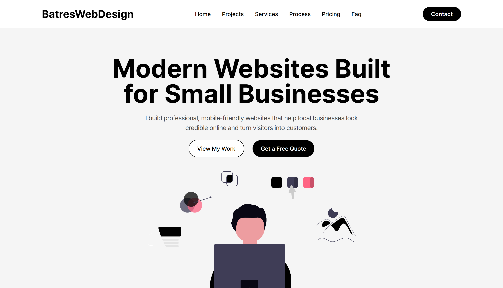

# Batres Web Design

A modern, responsive agency landing page built to showcase web development services, project portfolios, and transparent pricing structures for small businesses and local clients.

## Features
* **Modern UI/UX:** Clean, high-converting layout designed for fast navigation and mobile responsiveness.
* **Structured Pricing & Services:** Clear breakdown of business website packages, monthly management plans, and one-time support tiers.
* **Interactive Showcase:** Highlights featured projects across various client industries (landscaping, auto repair, restaurants, plumbing).
* **FAQ & Contact Sections:** Smoothly guides potential clients toward requesting quotes and getting in touch.

## Tech Stack
* **Framework:** Next.js / React
* **Styling:** Tailwind CSS
* **Deployment:** Vercel (or your deployment platform)